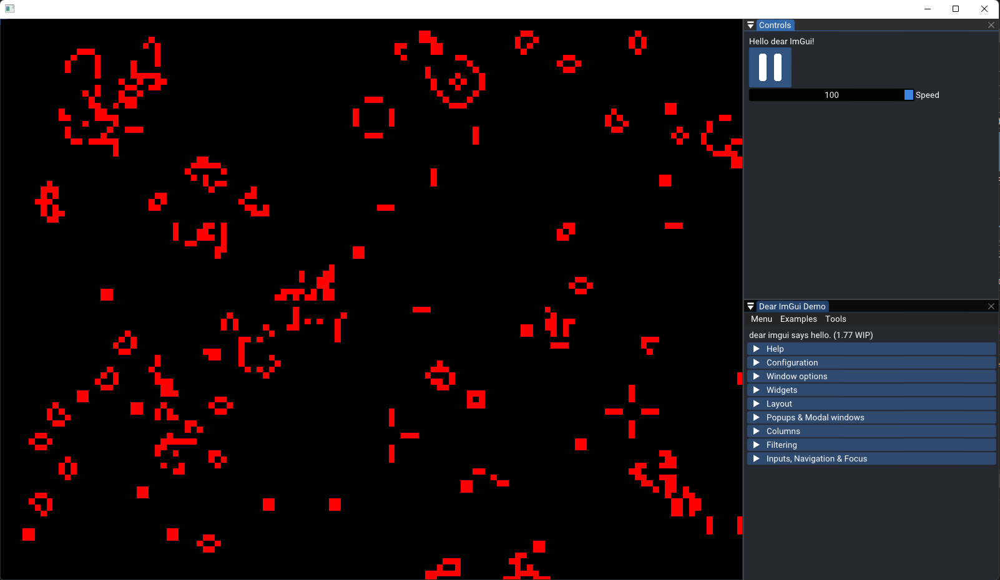

# Game of Life

A simple Game of Life playground written in C++ and OpenFrameworks. Uses hardware-accelerated **Compute Shaders** on GPU to be highly performant and simulate large map sizes.

#### Recent Screenshots

## Releases

Coming soon

## Building from Source

### Requirements

-   [Visual Studio](https://visualstudio.microsoft.com/) 2017 or higher (_optional, read note below_)
-   [OpenFrameworks](https://openframeworks.cc/)
-   [ofxImGui](https://github.com/jvcleave/ofxImGui)

**Note:** If you have OpenFrameworks installed and are using any other IDE/toolset other than Visual Studio, you just have to copy the source files from `src/` and the data folder from `bin/data` and put them in your project.
